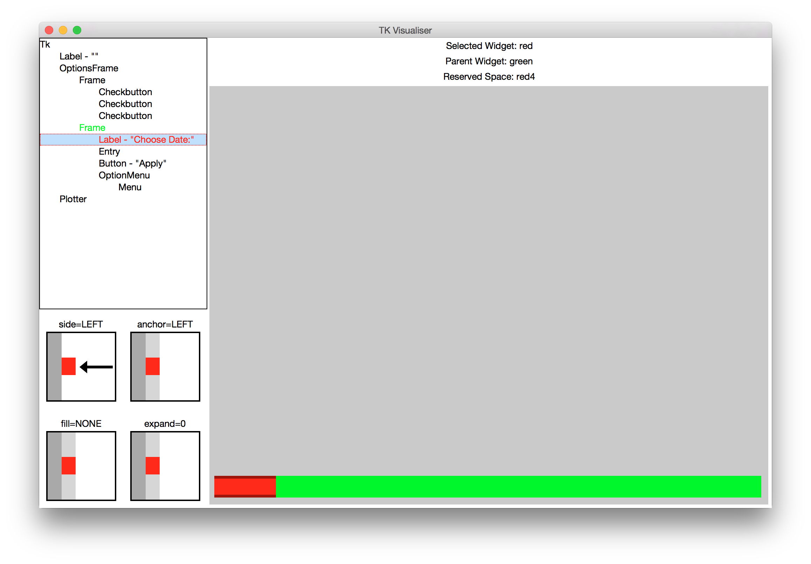
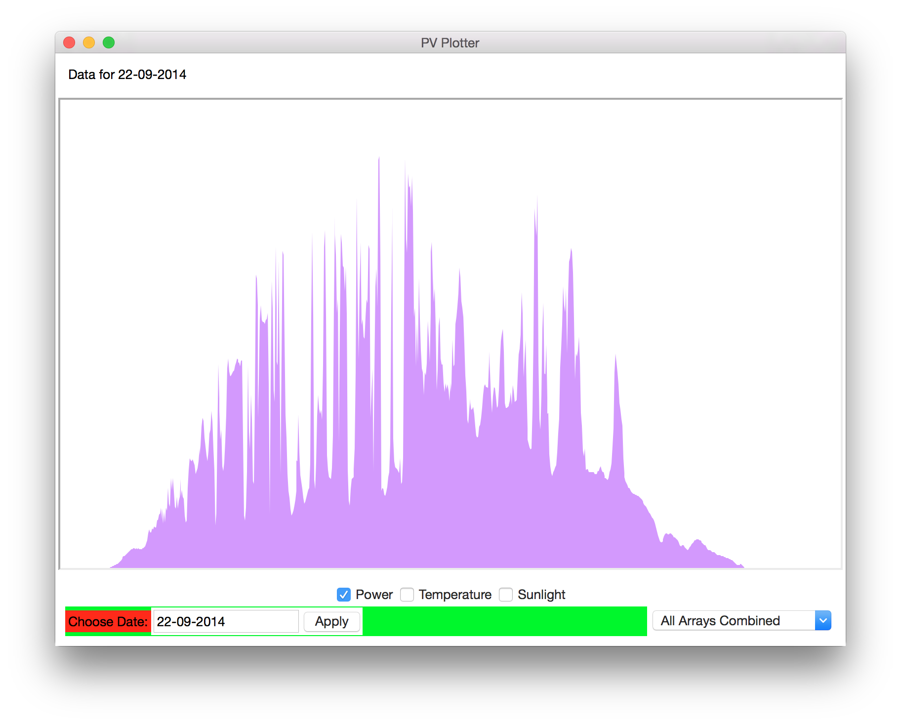

tkvis
=========

## Screenshots

### Tk Visualiser

### Hosted App

## Usage

Copy the code you wish to visualise into the same directory as `tkvis.py`
(or otherwise give it access to the module).

Replace all references to `Tkinter` with references to `tkvis`, eg:

    import Tkinter as tk  # -> import tkvis as tk
    from Tkinter import * # -> from tkvis import *
